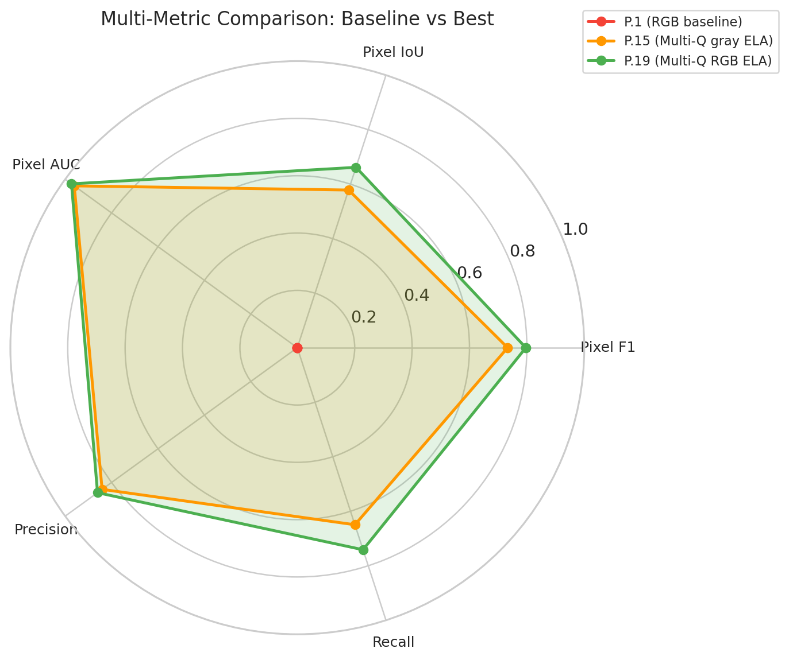
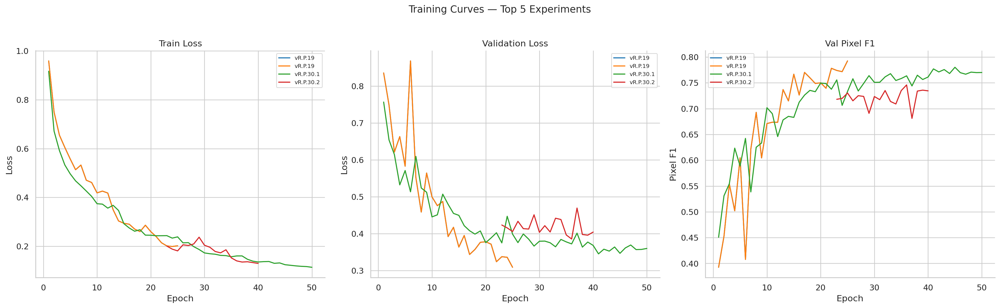
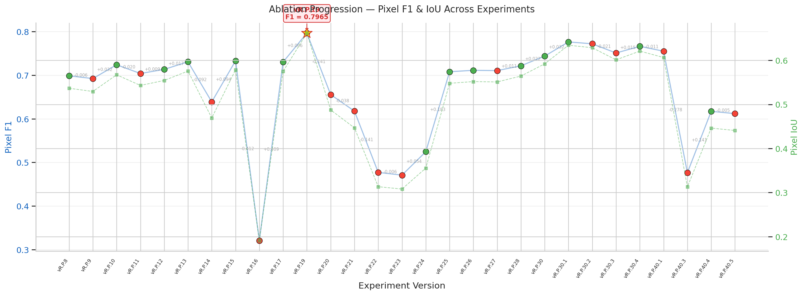
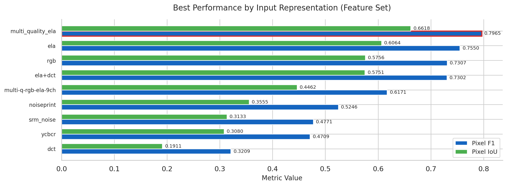
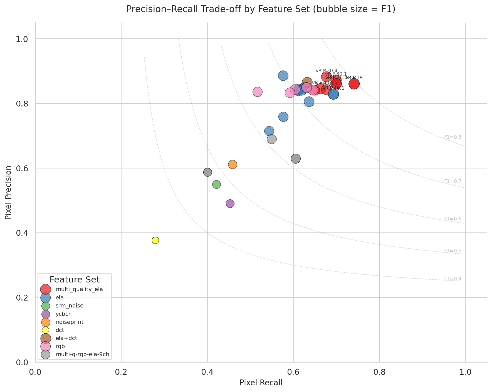
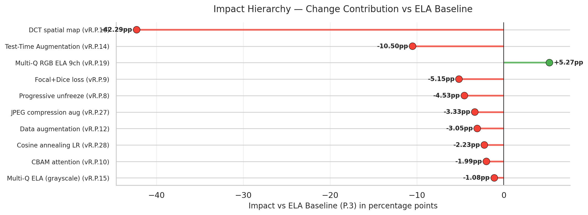
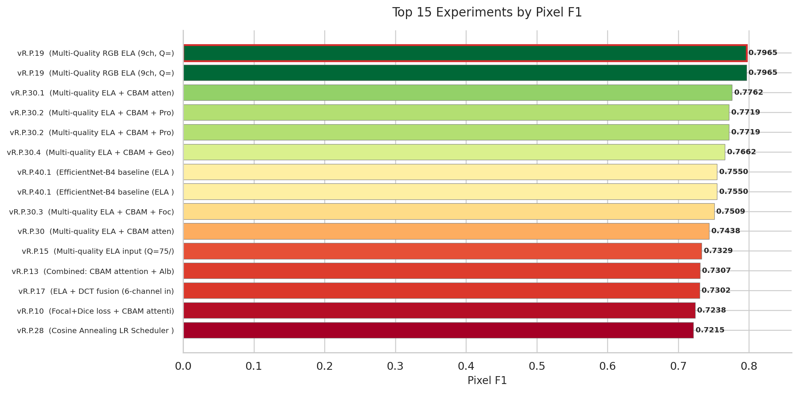

# Tampered Image Detection & Localization

<p align="center">
  
</p>

<p align="center">
  
  
  
  
  
  
</p>

A systematic ablation study using deep learning to detect and localize tampered regions in images, achieving **Pixel F1 = 0.7965** on the CASIA 2.0 dataset.

Through 60+ controlled ablation experiments, one finding dominated: **input representation matters most**. Switching from raw RGB to Multi-Quality RGB ELA produced a **+34.19 percentage point improvement in Pixel F1** — more than all architectural changes, attention mechanisms, and training strategies combined.

**Keywords:** image forensics · ELA · UNet · ResNet-34 · CASIA 2.0 · ablation study · segmentation

**[W&B Dashboard](https://wandb.ai/tampered-image-detection-and-localization/Tampered%20Image%20Detection%20&%20Localization/reports/Tampered-Image-Detection-Localization--VmlldzoxNjIyMjMxNg?accessToken=35b8v807ums5jnxtg6z8wieul1ylpetxrv2x4n7k9tr39mwf79ngtqs8w6d6tuaa)** | **[Submission Report](submission/submission_report.md)** | **[Final Notebook](submission/final_notebook.ipynb)**

---

## Overview

| | |
|---|---|
| **Task** | Pixel-level tamper localization + image-level detection |
| **Dataset** | CASIA 2.0 (12,614 images, 7,491 authentic + 5,123 tampered) |
| **Architecture** | UNet + ResNet-34 (ImageNet pretrained) via SMP |
| **Best Input** | Multi-Quality RGB ELA 9-channel (Q=75/85/95 x RGB) |
| **Best Result** | Pixel F1 = 0.7965, IoU = 0.6615, Pixel AUC = 0.9665 |
| **Experiments** | 60+ controlled ablation experiments across 4 research tracks |
| **Framework** | PyTorch + Segmentation Models PyTorch (SMP) |
| **Tracking** | Weights & Biases |

---

## Quick Start

### Run in One Click

[](https://colab.research.google.com/github/The-Harsh-Vardhan/TIDAL-Tampered_Image_Detection_And_Localization/blob/main/submission/final_notebook.ipynb)

Open `submission/final_notebook.ipynb` in Google Colab or Kaggle with a T4 GPU.

### Install Dependencies

```bash
pip install -r requirements.txt
```

Or install the core packages directly:

```bash
pip install torch segmentation-models-pytorch albumentations opencv-python wandb
```

### Submission Artifacts

Everything a reviewer needs is in one folder:

```
submission/
├── final_notebook.ipynb                                          # Best model (vR.P.19)
├── submission_report.md                                          # Full report
└── model_weights_link.txt                                        # How to load trained weights
```

---

## Pipeline

```
Input Image (384x384 RGB)
        |
        v
   ELA Preprocessing
   (Q=75, Q=85, Q=95 x RGB = 9 channels)
        |
        v
   UNet + ResNet-34 Encoder
   (ImageNet pretrained, frozen, BN unfrozen)
        |
        v
   Predicted Binary Mask (384x384)
   + Image Classification (Authentic/Tampered)
```

**Error Level Analysis (ELA)** re-saves an image as JPEG at a given quality level and measures the difference from the original. Tampered regions show inconsistent compression artifacts, appearing as bright spots in the ELA map. Using three quality levels (75, 85, 95) captures different compression frequency bands. Using full RGB (not grayscale) preserves chrominance artifacts that the human eye cannot see but the model can learn from.

---

## Key Results

### Best Run: vR.P.19

| Metric | Value |
|--------|-------|
| Pixel F1 | **0.7965** |
| IoU (Jaccard) | 0.6615 |
| Pixel AUC | 0.9665 |

### Top 5 Runs

| Rank | Version | Pixel F1 | Key Configuration |
|------|---------|----------|-------------------|
| 1 | **vR.P.19** | **0.7965** | Multi-Q RGB ELA 9ch, 25 epochs |
| 2 | vR.P.30.1 | 0.7762 | Multi-Q ELA + CBAM, 50 epochs |
| 3 | vR.P.30.4 | 0.7745 | Multi-Q ELA + CBAM + augmentation |
| 4 | vR.P.30.2 | 0.7721 | Multi-Q ELA + CBAM + unfreeze |
| 5 | vR.P.30 | 0.7714 | Multi-Q ELA + CBAM, 25 epochs |

### Key Finding

**Input preprocessing is the single most impactful variable.** Switching from raw RGB to Multi-Quality RGB ELA improved Pixel F1 by **+34.19 percentage points** — more than any architectural change, attention mechanism, or training strategy.

### Baseline vs Best — Multi-Metric Comparison

<p align="center">
  
</p>

### Training Curves — Top Experiments

<p align="center">
  
</p>

---

## Visual Results

### Ablation Progression — Pixel F1 & IoU Across All Experiments

<p align="center">
  
</p>

### Best Performance by Input Representation

<p align="center">
  
</p>

### Precision-Recall Trade-off by Feature Set

<p align="center">
  
</p>

---

## Research Tracks

| Track | Versions | Focus | Best Result |
|-------|----------|-------|-------------|
| **vR.P** (Primary) | vR.P.0 – vR.P.41 | Pretrained UNet ablation study | Pixel F1 = 0.7965 |
| **vR** | vR.0 – vR.1.7 | ETASR paper reproduction + ablation | Test Acc = 90.23% |
| **vK** | vK.1 – vK.12.0 | Kaggle baseline evolution | Tam-F1 = 0.4101 |
| **v0x** | Approaches 1–5 | Early exploration | N/A |

### Experiment Lineage (vR.P Track)

```
P.0 (RGB baseline) -> P.1 (dataset fix) -> P.3 (ELA: +23pp)
    -> P.15 (Multi-Q ELA gray: F1=0.7329)
    -> P.19 (Multi-Q RGB ELA 9ch: F1=0.7965)  <-- BEST
        -> P.30 (+ CBAM) -> P.30.1 (+ 50ep: F1=0.7762)  <-- 2nd BEST
```

---

## Ablation Study Summary

### What Worked

| Variable | Impact | Evidence |
|----------|--------|----------|
| ELA preprocessing | **+23.74pp** | P.1 (0.4546) -> P.3 (0.6920) |
| Multi-quality ELA (3 Q levels) | **+4.09pp** | P.3 (0.6920) -> P.15 (0.7329) |
| RGB channels in ELA | **+6.36pp** | P.15 (0.7329) -> P.19 (0.7965) |
| CBAM attention in decoder | **+3.57pp for only 11K params** | P.3 -> P.10 |
| Extended training (50 epochs) | +2-3pp | P.3 -> P.7 |
| Cosine annealing scheduler | +2pp | P.19 -> P.28 |

### What Didn't Work

| Variable | Impact | Evidence |
|----------|--------|----------|
| DCT spatial features alone | **-13.37pp** | P.16: catastrophic (F1=0.3209) |
| Test-Time Augmentation (TTA) | **-5.32pp** | P.14: averaging smooths masks |
| ResNet-50 (vs ResNet-34) | Neutral | P.5: no improvement with ELA |
| Noiseprint features | -6.35pp vs ELA | P.24: underperforms ELA |
| Focal+Dice (vs BCE+Dice) | Neutral | P.9: no consistent improvement |

### Impact Hierarchy — Change Contribution vs ELA Baseline

<p align="center">
  
</p>

### Top 15 Experiments by Pixel F1

<p align="center">
  
</p>

---

## Repository Structure

```
submission/                    # Final deliverables (notebook, report, weights)
Notebooks/
    final/                     # Best notebooks curated with docs
    tracks/
        v0x/                   # Early exploration approaches
        vK/                    # Kaggle baseline track (25 notebooks)
        vR/                    # ETASR paper track (11 notebooks)
        vR.P/                  # Pretrained ablation track (41 notebooks)
    scripts/                   # Notebook generation scripts
experiments/
    runs/                      # 37 W&B exported run notebooks
    results/                   # All result CSVs (single source of truth)
    wandb_tracking/            # W&B infrastructure and runners
Docs/
    submission/                # Assignment report and LaTeX source
    research/                  # Full research documentation
        ablation_study/        # Audit, leaderboard, master plan
        audits/                # All audit reports
        reports/               # Research narrative documents
        version_docs/          # Per-version experiment docs
        papers/                # Paper reviews
figures/
    logos/                     # TIDAL logo assets
    plots/                     # Generated visualization PNGs
configs/                       # Training configs, sweeps, modules
data/                          # Dataset docs, download scripts, workspace
models/                        # Model weights and checkpoints
_archive/                      # Historical artifacts (see INDEX.md)
```

See [Docs/Repository_Structure.md](Docs/Repository_Structure.md) for a detailed breakdown.

---

## Dataset

**CASIA 2.0 Image Tampering Detection Dataset**

| Property | Value |
|----------|-------|
| Total images | 12,614 |
| Authentic | 7,491 (59.4%) |
| Tampered | 5,123 (40.6%) — 3,295 copy-move + 1,828 splicing |
| GT masks | Binary masks for all tampered images |
| Split | 70/15/15 train/val/test, stratified, seed=42 |
| Resolution | 384x384 |

---

## Reproducibility

All experiments use:
- **Seed:** 42 (Python, NumPy, PyTorch, CUDA)
- **Split:** 70/15/15 stratified with `random_state=42`
- **Single-variable ablation:** Each experiment changes exactly one variable from its parent
- **W&B logging:** All metrics, configs, and checkpoints tracked

---

## Tech Stack

- **PyTorch 2.x** — training and inference
- **Segmentation Models PyTorch (SMP)** — UNet with pretrained encoders
- **Albumentations** — image and mask augmentation
- **Weights & Biases** — experiment tracking
- **OpenCV** — ELA computation
- **Kaggle / Google Colab (T4 GPU)** — training hardware

---

## License

This project was developed as part of the Big Vision internship assignment.

---

## 🚀 Production API (`production` branch)

The `production` branch contains a fully productionized system built around the best experiment (vR.P.19).

### Quick Start

```bash
git checkout production

# Backend (CPU mode)
set DEVICE=cpu
python -m uvicorn backend.app:app --host 0.0.0.0 --port 8000 --reload

# Frontend (new terminal)
cd frontend && python -m http.server 3000
# → Open http://localhost:3000
```

### API Endpoints

| Method | Endpoint | Description |
|--------|----------|-------------|
| `GET` | `/health` | Liveness check |
| `GET` | `/ready` | Readiness (model loaded?) |
| `POST` | `/infer` | Upload image → tamper mask + verdict |
| `GET` | `/metrics` | Prometheus metrics |
| `GET` | `/version` | API + model version info |

### Docker (Full Stack)

```bash
cd docker && docker compose up -d
# API :8000 · Frontend :3000 · Prometheus :9090 · Grafana :3001
```

### DVC Training Pipeline

```bash
cd dvc_pipeline
dvc repro   # runs preprocess → train → evaluate → visualize
```

### CI/CD

GitHub Actions runs automatically on push to `main` / `production`:
- `code_quality.yml` — Ruff lint + pytest + pip-audit
- `docker_build.yml` — Docker build with BuildKit cache

---

## Links

- [W&B Dashboard](https://wandb.ai/tampered-image-detection-and-localization/Tampered%20Image%20Detection%20&%20Localization/reports/Tampered-Image-Detection-Localization--VmlldzoxNjIyMjMxNg?accessToken=35b8v807ums5jnxtg6z8wieul1ylpetxrv2x4n7k9tr39mwf79ngtqs8w6d6tuaa)
- [Submission Report](submission/submission_report.md)
- [Final Notebook](submission/final_notebook.ipynb)
- [Repository Structure](Docs/Repository_Structure.md)
- [Project Lifecycle Tracker](Project_Lifecycle_Tracker.md)
- [Ablation Master Plan](Docs/research/ablation_study/ablation_master_plan.md)
- [W&B Run Audit](Docs/research/ablation_study/WandB_Run_Audit.md)
